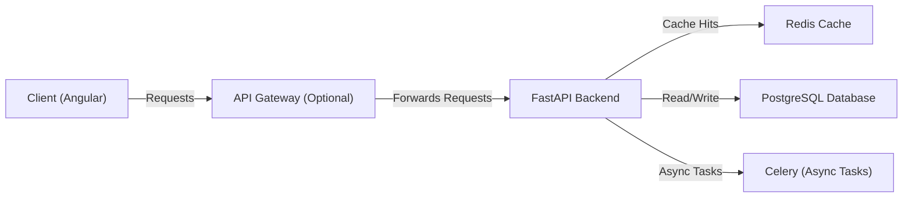

# URL Shortener System Design

## **1️⃣ High-Level Architecture**
The system consists of:
1. **Frontend (Angular)**: Handles user authentication, URL input, and analytics.
2. **Backend (FastAPI)**: Manages URL shortening, authentication, and analytics.
3. **Database (PostgreSQL)**: Stores user data and URL mappings.
4. **Cache (Redis)**: Caches hit counts for performance.

