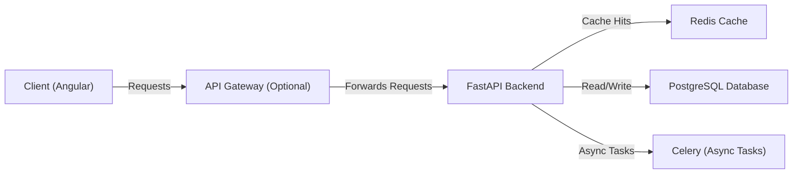
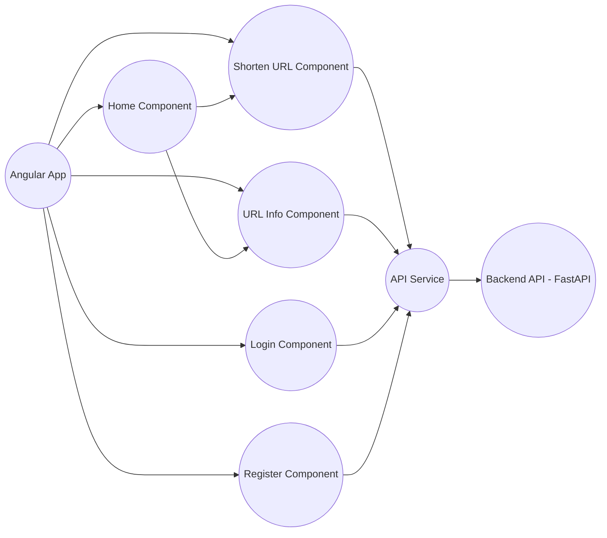
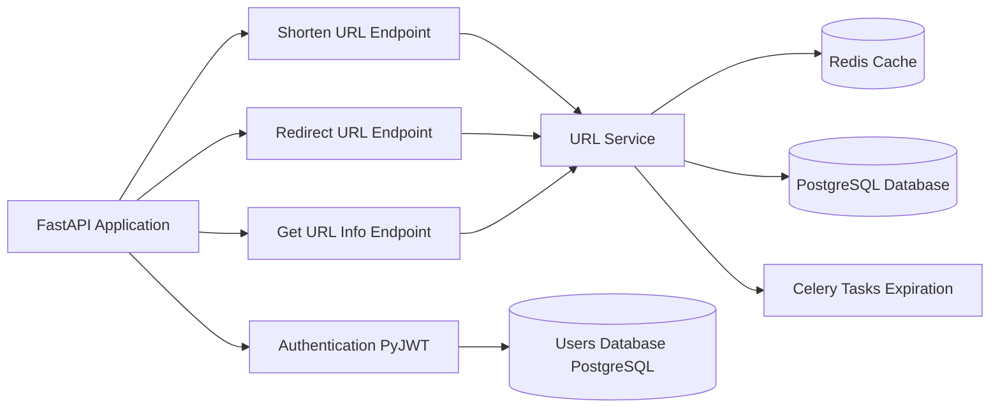
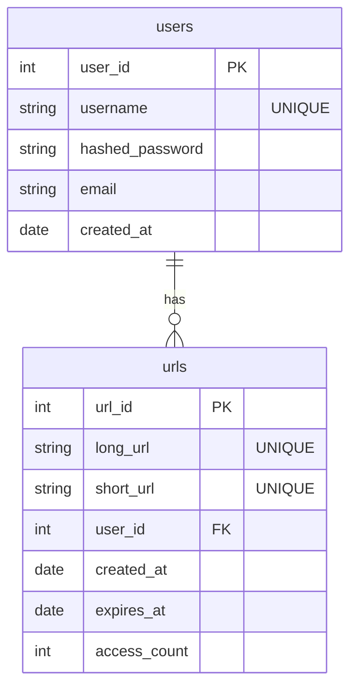

# System Design: URL Shortening Service

## 1. Overview

This document outlines the system design for a URL shortening service The service allows users to shorten long URLs, redirect to the original URLs using the shortened URLs, track access counts, and set expiration times.

## 2. Goals

*   **Functionality:** Provide core URL shortening and redirection functionality.
*   **Scalability:** Design for handling a reasonable number of requests.
*   **Reliability:** Ensure the service is available and performs consistently.
*   **Maintainability:** Write clean, modular, and well-documented code.
*   **Security:** Protect against unauthorized access and malicious attacks.

## 3. Tech Stack

*   **Frontend:**
    *   Angular
    *   Angular Material (UI Components)
*   **Backend:**
    *   FastAPI (Python)
    *   PostgreSQL (Database)
    *   Redis (Cache)
    *   PyJWT (Authentication)
    *   Uvicorn (ASGI Server)
    *   Gunicorn (WSGI Server)
*   **Infrastructure:**
    *   Docker (Containerization)
    *   Cloud Provider (AWS, Google Cloud, Azure - Optional)

## 4. System Architecture

**Components:**

*   **Client (Angular):** User interface for interacting with the service.
*   **API Gateway (Optional):** Provides a single entry point for all API requests, handling authentication, rate limiting, etc.
*   **FastAPI Backend:** Handles the core logic of the service.
*   **Redis Cache:** Stores frequently accessed URL mappings for fast retrieval.
*   **PostgreSQL Database:** Stores persistent data, such as user information, access statistics, and URL mappings.
*   **Celery (Async Tasks):** Handles background tasks, such as expiring URLs and updating access counts.

## 5. Frontend Design (Angular)

**Components:**

*   **App Component:** The root component of the Angular application.
*   **Home Component:** The main page, displaying the URL shortening form and URL information.
*   **Shorten URL Component:** Handles the URL shortening form and API call.
*   **URL Info Component:** Displays information about a shortened URL (access count, expiration).
*   **Login Component:** Handles user login.
*   **Register Component:** Handles user registration.
*   **API Service:** A service that handles communication with the backend API.

**Data Flow:**

1.  User interacts with the Angular components (e.g., enters a long URL in the Shorten URL Component).
2.  The component calls the API Service.
3.  The API Service makes an HTTP request to the FastAPI backend.
4.  The backend processes the request and returns a response.
5.  The API Service receives the response and updates the Angular component.
6.  The component displays the results to the user.

## 6. Backend Design (FastAPI)

**Modules:**

*   **FastAPI Application:** The main application instance.
*   **Authentication (PyJWT):** Handles user authentication and authorization.
*   **Shorten URL Endpoint:** API endpoint for shortening URLs.
*   **Redirect URL Endpoint:** API endpoint for redirecting short URLs to original URLs.
*   **Get URL Info Endpoint:** API endpoint for retrieving information about a short URL.
*   **URL Service:** A service that handles the core URL shortening logic, interacting with Redis, PostgreSQL, and Celery.

**Data Flow:**

1.  The FastAPI application receives an HTTP request.
2.  The request is routed to the appropriate endpoint (e.g., Shorten URL Endpoint).
3.  The endpoint calls the URL Service.
4.  The URL Service interacts with Redis to check if the URL is already cached.
5.  If the URL is not cached, the URL Service interacts with PostgreSQL to store the URL mapping.
6.  The URL Service generates a short URL.
7.  The URL Service stores the URL mapping in Redis and PostgreSQL.
8.  The URL Service returns the short URL to the endpoint.
9.  The endpoint returns the response to the client.

## 7. Database Schema (PostgreSQL)

**Tables:**

*   **users:** Stores user information (username, password, email).
*   **urls:** Stores URL mappings (long URL, short URL, user ID, creation time, expiration time, access count).

## 8. Redis Schema

Redis will be used as a cache for frequently accessed URL mappings and access counts.

*   `short_url:{short_url}`: Stores the long URL associated with a short URL.  (e.g., `short_url:xyz123` -> `https://www.example.com/very/long/url`)
*   `long_url:{long_url}`: Stores the short URL associated with a long URL. (e.g., `long_url:https://www.example.com/very/long/url` -> `xyz123`)
*   `access_count:{short_url}`: Stores the access count for a short URL. (e.g., `access_count:xyz123` -> `1234`)
*   `expires_at:{short_url}`: Stores the expiration timestamp for a short URL. (e.g., `expires_at:xyz123` -> `2024-12-31T23:59:59`)
*   `next_url_id`:  A counter to generate unique URL IDs.

## 9. Authentication (PyJWT)

*   Users will register with a username and password.
*   The backend will hash the password using a secure hashing algorithm (e.g., bcrypt).
*   Upon login, the backend will verify the password and generate a JWT.
*   The JWT will be included in the `Authorization` header of subsequent requests.
*   The backend will verify the JWT before processing the request.

## 10. Scalability Considerations

*   **Caching:** Use Redis to cache frequently accessed URL mappings.

## 11. Security Considerations

*   **Input Validation:** Validate all user input to prevent injection attacks.
*   **Authentication and Authorization:** Implement proper authentication and authorization to protect against unauthorized access.
*   **HTTPS:** Use HTTPS to encrypt all communication between the client and the server.
*   **Rate Limiting:** Implement rate limiting to prevent denial-of-service (DoS) attacks.

## 12. Deployment

*   Use Docker to containerize the application.
*   Deploy the application to a cloud provider (AWS, Google Cloud).

